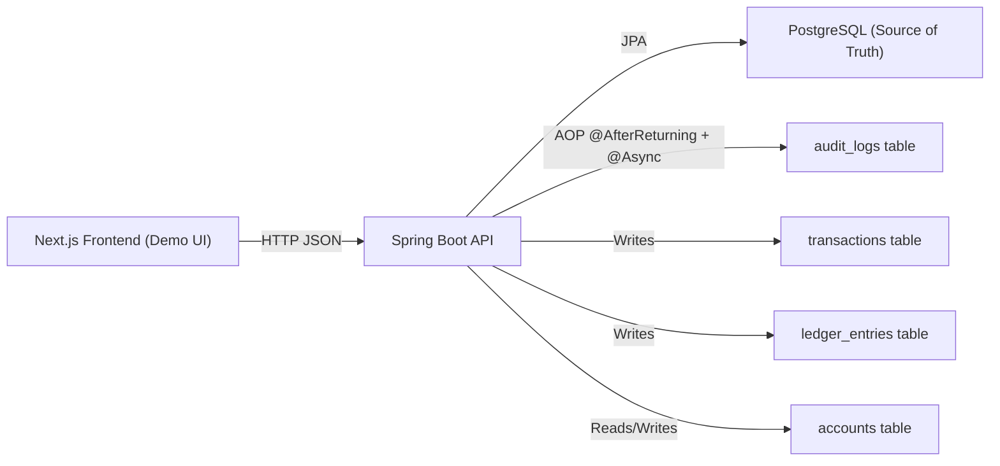

# LedgerX Features & Functionality Report

Date: 2026-02-21

This report describes LedgerX based on the current repository contents:

- Backend: `LedgerX/` (Spring Boot + JPA + PostgreSQL)
- Frontend: `frontend_ledgerx/` (Next.js App Router + Tailwind + shadcn/ui-style components)

It focuses on implemented behavior, plus "wired but missing" behavior (where the frontend expects endpoints that the backend does not currently expose).

## 1. Product Overview (What LedgerX Is)

LedgerX is a transactional money-movement engine implementing:

- Atomic transfers (ACID) between two accounts
- Double-entry accounting (a debit + a credit ledger entry per transfer)
- Concurrency control via row-level locks (pessimistic locking)
- Request idempotency via `Idempotency-Key`
- Structured error responses for client handling
- Audit logging of successful transfers via Spring AOP + async execution

The repository also includes a Next.js UI that acts as a demo console for running manual transfers and simulating high concurrency.

## 2. High-Level Architecture



### Core components

- **Frontend demo console**: polls account balances and recent transactions, submits transfers, runs concurrency simulations.
- **Transfer API**: accepts transfer requests with idempotency key, performs validation, locks rows, updates balances, writes ledger entries, completes a transaction record.
- **PostgreSQL**: holds accounts, transactions, ledger entries, and audit logs; ledger entries are append-only facts.

## 3. Frontend Features (Next.js)

### 3.1 Home page (Landing)

Purpose: present LedgerX and route users to the demo or architecture write-up.

User actions:

- Navigate to:
  - `"/demo"`: demo console
  - `"/architecture"`: architecture explanation

### 3.2 Architecture page

Purpose: explain design choices (double-entry, locking, idempotency, audit logging) with illustrative code snippets.

Notes:

- The snippets are explanatory and not guaranteed to exactly match the backend implementation (they are documentation-like content embedded in the UI).

### 3.3 Demo console (High-Concurrency Transfer Dashboard)

Purpose: an interactive UI to drive transfers and observe balances + transaction feed.

Features:

- **Configurable accounts** (via env vars, with defaults):
  - Account A number (default `"ACC-A-001"`)
  - Account B number (default `"ACC-B-001"`)
- **Configurable backend base URL**:
  - `NEXT_PUBLIC_LEDGERX_API_URL` (default `"http://localhost:8080"`)
- **Live polling**:
  - Poll interval: 2 seconds
  - Polls:
    - Account A details
    - Account B details
    - Recent transactions (filters to `COMPLETED` on the client)
- **Manual transfer form**:
  - Transfer from Account A to Account B
  - User-provided amount
  - Uses the wallet currency if available, otherwise `"USD"`
- **Concurrency simulation / stress test**:
  - Slider to choose concurrency (10..100)
  - Fires N concurrent transfer requests using `Promise.all`
  - Summarizes outcomes:
    - success count
    - HTTP 409 conflicts
    - HTTP 422 insufficient funds
    - other errors
- **Live ledger table**:
  - Displays recent completed transactions with created timestamp, transaction ID, status, and idempotency key

### 3.4 Frontend API expectations (important)

The demo UI calls three endpoints:

1. `GET /api/v1/accounts/{accountNumber}`
2. `GET /api/v1/transactions/recent?limit={n}`
3. `POST /api/v1/transfers`

In the current backend code, only the transfer endpoint is implemented (see Section 4.1). The account and recent-transactions endpoints are currently missing on the server.

## 4. Backend Features (Spring Boot)

### 4.1 Public API Surface

#### 4.1.1 Transfer money between two accounts

- Method/Path: `POST /api/v1/transfers`
- Header: `Idempotency-Key: <string>`
- Body (JSON):
  - `fromAccount`: string (required, non-blank)
  - `toAccount`: string (required, non-blank)
  - `amount`: number/decimal (required, positive)
  - `currency`: string (required, non-blank)
- Response (JSON): `Transaction` entity serialized, including:
  - `id`, `idempotencyKey`, `status`, `createdAt`, optionally `completedAt`

#### 4.1.2 Error responses

Backend errors are returned as JSON:

```json
{ "timestamp": "...", "status": 400, "message": "..." }
```

Status mapping (implemented by a global exception handler):

- 422: insufficient funds
- 404: account not found
- 409: idempotency conflict or optimistic locking conflict
- 400: validation errors or general ledger/business validation errors
- 500: unexpected errors

### 4.2 Transfer Engine (What Happens During a Transfer)

The transfer pipeline in `TransferService.processTransfer(...)` does:

1. **Idempotency check**:
   - If a transaction with the given idempotency key exists and is `COMPLETED`, return it.
   - If it exists and is `PENDING`, reject with a conflict.
   - If it exists with any other status, reject with a conflict.
2. **Create a transaction record** with status `PENDING`.
3. **Validate request**:
   - idempotency key present
   - from/to present and not equal
   - amount > 0
   - currency present
4. **Row-lock the two account rows** using `PESSIMISTIC_WRITE` (database-level row lock).
   - Account numbers are sorted before locking to reduce deadlock risk.
5. **Validate business rules**:
   - transfer currency matches both account currencies
   - neither account is `FROZEN`
   - source account has sufficient funds
6. **Update balances**:
   - subtract from source
   - add to destination
7. **Write double-entry ledger**:
   - create `LedgerEntry` DEBIT for the source
   - create `LedgerEntry` CREDIT for the destination
8. **Complete the transaction**:
   - set status `COMPLETED`
   - set `completedAt = now`

The method is wrapped in a database transaction (`READ_COMMITTED`, `REQUIRES_NEW`), so balance updates + ledger writes + transaction completion commit together or roll back together.

### 4.3 Double-Entry Accounting Model

Each successful transfer results in exactly two ledger entries:

- DEBIT entry on the source account
- CREDIT entry on the destination account

Ledger entries are modeled as immutable facts (amount is `updatable = false` and entries are only inserted by the transfer service).

### 4.4 Concurrency Control

LedgerX uses **pessimistic row-level locking** for accounts:

- `AccountRepository.findByAccountNumberForUpdate(...)` uses `PESSIMISTIC_WRITE`.
- Lock timeout is configured to 3000ms (3 seconds) via a JPA query hint.
- Accounts are locked in deterministic order (sorted account numbers) to reduce deadlock probability.

Additionally, accounts have a `@Version` field for optimistic locking, but the main transfer flow relies on explicit pessimistic locks.

### 4.5 Audit Logging (Compliance Trail)

LedgerX includes an AOP-based audit mechanism:

- `@AuditableTransfer` annotation marks the transfer method.
- An aspect intercepts successful returns and writes two audit events:
  - `TRANSFER_OUT` for the sender account
  - `TRANSFER_IN` for the receiver account
- The audit writes run asynchronously (`@Async`), enabled by `@EnableAsync` on the Spring Boot app.

The audit log stores:

- account number
- action string
- amount
- timestamp

## 5. Data Model (Entities / Tables)

### 5.1 Account (`accounts`)

Key fields and constraints:

- `id`: UUID (primary key)
- `accountNumber`: unique, immutable after creation
- `currency`: 3-letter ISO-like code
- `balance`: numeric(19,4), check constraint `balance >= 0`
- `status`: `ACTIVE` / `FROZEN` / `CLOSED`
- `version`: optimistic lock version
- `createdAt`, `updatedAt`

Relationships:

- One account has many ledger entries.

### 5.2 Transaction (`transactions`)

Key fields:

- `id`: UUID (primary key)
- `idempotencyKey`: unique, immutable
- `status`: `PENDING` / `COMPLETED` / `FAILED`
- `errorMessage`: nullable (present but not currently set by transfer flow)
- `createdAt`, `completedAt`

Relationships:

- One transaction has many ledger entries.

### 5.3 LedgerEntry (`ledger_entries`)

Key fields:

- `id`: UUID (primary key)
- `transaction_id`: FK to transaction
- `account_id`: FK to account
- `amount`: numeric(19,4), immutable
- `direction`: `DEBIT` / `CREDIT`
- `createdAt`

### 5.4 AuditLog (`audit_logs`)

Key fields:

- `id`: UUID (primary key)
- `accountNumber`
- `action` (e.g. `TRANSFER_OUT`, `TRANSFER_IN`)
- `amount`
- `timestamp`

Note: audit logs are not linked to transaction IDs in the current model, only to account numbers.

## 6. Testing & Verification Features

### 6.1 Testcontainers-backed integration tests

The backend test suite uses Testcontainers with `postgres:latest` to run integration tests against a real PostgreSQL instance.

### 6.2 Concurrency correctness test

`TransferServiceConcurrencyTest` provisions two accounts and executes 100 concurrent transfers.

Assertions performed:

- Final balances match expected debits/credits (A decreases, B increases).
- 100 transactions exist and are completed.
- 200 ledger entries exist (2 per transfer).

This test is the main validation of:

- locking strategy correctness under concurrency
- double-entry invariants (count-based)

## 7. Integrations / Configuration / Operational Notes

### 7.1 Database configuration

Backend uses PostgreSQL via `spring.datasource.*`.

Important security note:

- The current `LedgerX/src/main/resources/application.properties` contains a full database URL, username, and password committed in-repo. This is a serious secret-management issue (see Section 8).

### 7.2 Flyway migrations

Flyway is included as a dependency and the migration folder exists, but there are currently no migration files in `LedgerX/src/main/resources/db/migration/`.

Implication:

- Schema creation is likely relying on Hibernate DDL auto-generation (implicitly) or an externally provisioned database schema.
- The demo UI expects two existing accounts (`ACC-A-001`, `ACC-B-001`), but there is no seed migration/data initializer in this repo.

### 7.3 Async execution

Audit logging is async. No custom executor configuration is present, so Spring’s default async executor behavior applies.

## 8. Gaps, Risks, and Mismatches (As Seen In This Repo)

### 8.1 Frontend/Backend mismatch (missing endpoints)

Frontend requires but backend does not currently implement:

- `GET /api/v1/accounts/{accountNumber}`
- `GET /api/v1/transactions/recent?limit={n}`

Without these, the demo dashboard’s live balance and transaction feed will fail (while `POST /api/v1/transfers` can still work if accounts exist in DB).

### 8.2 Secrets committed to source control

`LedgerX/src/main/resources/application.properties` includes hardcoded database credentials.

Recommended remediation (high priority):

- Remove/rotate credentials immediately.
- Replace with env-driven configuration (e.g. `SPRING_DATASOURCE_URL`, `SPRING_DATASOURCE_USERNAME`, `SPRING_DATASOURCE_PASSWORD`) and local-only overrides.

### 8.3 Idempotency under concurrency

The current implementation checks for an existing transaction, then inserts a new one. Under concurrent requests with the same idempotency key, this pattern can produce a unique-constraint violation on insert that is not explicitly handled/mapped to a clean 409 response.

### 8.4 Transaction failure recording is incomplete

The `Transaction` entity supports `FAILED` + `errorMessage`, but `TransferService` never persists a failed transaction record. On any exception, the whole database transaction rolls back, leaving no record for forensic tracing of failed attempts.

### 8.5 Lock-timeout / contention error mapping

Account locks have a 3-second timeout. Timeout/locking exceptions are not explicitly mapped in `GlobalExceptionHandler`, so some contention scenarios may surface as 500s rather than a client-actionable 409/503.

### 8.6 Audit log timing semantics

Audit logs are written asynchronously after the transfer method returns, but not explicitly after commit. If you need strict "only after commit" semantics, the audit pipeline should be transaction-synchronization aware.

### 8.7 Missing authn/authz and operational controls

No authentication/authorization, rate limiting, or service-to-service protection is present in the backend. For a financial ledger engine, these are typically required.

## 9. Suggested Next Implementations (If You Want Full End-to-End Demo)

To make the demo UI fully functional end-to-end:

1. Implement `GET /api/v1/accounts/{accountNumber}` returning account details.
2. Implement `GET /api/v1/transactions/recent?limit=n` returning latest transactions (likely order by `createdAt desc`).
3. Add Flyway migrations to create tables and seed demo accounts (`ACC-A-001`, `ACC-B-001`).
4. Remove committed secrets and switch to environment-driven DB config.

