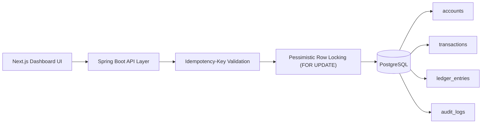

# LedgerX: High-Concurrency Payment Engine


**Engineer:** Artem Moshnin

## Overview (The Elevator Pitch)
LedgerX is an **ACID-compliant**, high-throughput payment ledger built to execute concurrent money movement safely at enterprise scale. The platform uses a transactional core (Spring Boot + PostgreSQL) with strict double-entry guarantees, deterministic locking, and idempotent request handling so that retries, bursts of concurrent transfers, and partial failures do **not** produce race conditions, double charges, or ledger drift. A Next.js dashboard provides operational visibility into account balances and transfer activity in real time.

## System Architecture


## Key Architectural Decisions (Crucial for Tech Leads)

### 1) Double-Entry Accounting
LedgerX treats every transfer as an immutable accounting event represented by exactly two ledger entries: one **DEBIT** and one **CREDIT** tied to the same transaction. Money is never "edited" in place as a business event; it is moved via immutable entries, giving deterministic reconstruction and traceability of all financial movement over time.

### 2) Concurrency Control
To protect balance correctness under heavy parallel traffic:

- **Pessimistic locking:** source and destination accounts are fetched with `PESSIMISTIC_WRITE` (`FOR UPDATE` semantics).
- **Deadlock prevention:** account locks are acquired in **sorted account-number order** for every transfer.
- **Optimistic safeguard:** `@Version` on `Account` provides version-based conflict detection as an additional integrity control.

### 3) Idempotency
`POST /api/v1/transfers` requires an `Idempotency-Key` header. The key is persisted with a uniqueness constraint, ensuring network retries cannot create duplicate financial transactions. Replays of completed requests return the same transaction identity; in-flight duplicates are rejected with conflict semantics.

### 4) Audit Logging
Audit persistence is event-driven and transaction-safe using:

`@TransactionalEventListener(phase = TransactionPhase.AFTER_COMMIT)`

This guarantees audit logs are written **only after** the core DB transaction commits successfully, preventing orphan audit records when transfer processing rolls back.

## The Tech Stack

### Backend
- Java 17
- Spring Boot (transactional service layer + validation)
- Spring Data JPA / Hibernate
- PostgreSQL
- Flyway migrations

### Frontend
- Next.js
- React
- TypeScript
- Tailwind-based UI stack

### Testing & Quality
- JUnit 5
- Spring Boot Test
- Testcontainers (PostgreSQL integration tests)
- k6 (load and stress testing)

## Performance & Load Testing
LedgerX includes a k6 stress harness at `LedgerX/scripts/load_test.js` to validate correctness and throughput under sustained concurrent transfer load.

- Scenario profile uses concurrent virtual users against `POST /api/v1/transfers`.
- Validation checks assert no server-side `500` outcomes during load.
- Current benchmark target/result: **500+ TPS** with **zero dropped requests** and **no data integrity violations**.


## Getting Started (Local Development)

### 1) Prerequisites
- Java 17+
- Node.js 20+
- Docker (recommended for local PostgreSQL)
- npm

### 2) Configure environment variables
Create `LedgerX/.env`:

```bash
SPRING_DATASOURCE_URL=jdbc:postgresql://localhost:5432/ledgerx
SPRING_DATASOURCE_USERNAME=postgres
SPRING_DATASOURCE_PASSWORD=postgres
```

Create `frontend_ledgerx/.env.local`:

```bash
NEXT_PUBLIC_LEDGERX_API_URL=http://localhost:8080
NEXT_PUBLIC_LEDGERX_ACCOUNT_A=ACC-A-001
NEXT_PUBLIC_LEDGERX_ACCOUNT_B=ACC-B-001
```

### 3) Start PostgreSQL
```bash
docker run --name ledgerx-postgres \
  -e POSTGRES_DB=ledgerx \
  -e POSTGRES_USER=postgres \
  -e POSTGRES_PASSWORD=postgres \
  -p 5432:5432 \
  -d postgres:16
```

### 4) Run backend (Spring Boot + Flyway migrations)
Flyway migrations are executed automatically on application startup before the API is served.

```bash
cd LedgerX
set -a && source .env && set +a
./gradlew bootRun
```

### 5) Run frontend (Next.js dashboard)
```bash
cd frontend_ledgerx
npm install
npm run dev
```

### 6) Run tests and load tests (optional but recommended)
```bash
cd LedgerX
./gradlew test
k6 run scripts/load_test.js
```

## API Reference

| Method | Endpoint | Description | Notes |
|---|---|---|---|
| `POST` | `/api/v1/transfers` | Execute a transfer between two accounts. | Requires `Idempotency-Key` header and JSON body: `fromAccount`, `toAccount`, `amount`, `currency`. |
| `GET` | `/api/v1/accounts/{id}` | Fetch account snapshot. | In this implementation, `{id}` maps to `accountNumber` (example: `ACC-A-001`). |
| `GET` | `/api/v1/transactions/recent` | Retrieve most recent transfers. | Supports `?limit=` with server-side cap. |

## Why This Project Matters for Enterprise Backend Engineering
LedgerX demonstrates production-grade financial backend patterns expected in senior roles: strong transactional boundaries, explicit concurrency design, deterministic idempotency behavior, migration-managed schema evolution, auditability, and repeatable integration/load verification with Testcontainers and k6.
