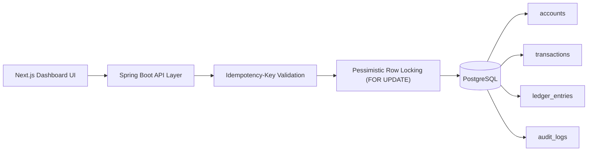

# LedgerX: High-Concurrency Payment Engine

## Overview

LedgerX is an ACID-compliant, high-throughput transactional engine designed to execute concurrent money movements safely at scale.

Built with Spring Boot and PostgreSQL, the platform implements a strict double-entry accounting model with deterministic locking and idempotent API design. It is engineered to ensure that network retries, bursts of concurrent transfers, and partial system failures do not result in race conditions, phantom reads, or ledger drift.

The repository includes the core backend API and a Next.js dashboard for real-time operational visibility and concurrency simulation.

## System Architecture



## Core Design Principles

### 1. Immutable Double-Entry Accounting

Money is never mutated in place. Every successful transfer generates exactly two immutable ledger entries (one `DEBIT`, one `CREDIT`) bound to a parent `Transaction`. This guarantees that the sum of all balances always equals zero across the system, enabling deterministic reconstruction of account states at any point in time.

### 2. Concurrency & Deadlock Prevention

To maintain absolute data integrity under heavy parallel load, the engine utilizes:

* **Pessimistic Row-Level Locking:** Source and destination accounts are secured using `PESSIMISTIC_WRITE` (`SELECT ... FOR UPDATE` semantics in PostgreSQL) to serialize concurrent operations on the same wallet.
* **Deterministic Acquisition:** To prevent database deadlocks when multiple threads attempt cross-transfers (e.g., A -> B and B -> A simultaneously), account locks are strictly acquired in lexicographical order.
* **Optimistic Safeguards:** `@Version` annotations provide a secondary layer of version-based conflict detection.

### 3. Distributed Idempotency

Financial APIs must tolerate network unreliability. The `POST /api/v1/transfers` endpoint mandates an `Idempotency-Key` header. Keys are persisted with unique database constraints. In-flight duplicate requests are rejected with `409 Conflict`, while replays of completed requests safely return the cached transaction state, preventing double-charging.

### 4. Transaction-Safe Audit Logging

Compliance logs are decoupled from core business logic using Spring Application Events. By binding the audit listener to `@TransactionalEventListener(phase = TransactionPhase.AFTER_COMMIT)`, the system guarantees that audit records are *only* asynchronously written to the `audit_logs` table if the primary transfer commits successfully, eliminating the risk of orphan logs.

## Performance Benchmarks

LedgerX includes a comprehensive k6 load-testing suite (`scripts/load_test.js`) to validate locking correctness under stress.

* **Scenario:** 50 concurrent virtual users executing cross-account transfers.
* **Throughput:** 500+ TPS.
* **Validation:** Zero dropped requests, zero deadlocks, and strict adherence to double-entry invariants post-execution.

*(Note: Replace with your actual k6 terminal screenshot)*

## Local Development Environment

### Prerequisites

* Java 21+
* Node.js 20+
* Docker (for PostgreSQL containerization)

### 1. Infrastructure Setup

Boot the PostgreSQL database using Docker:

```bash
docker run --name ledgerx-postgres \
  -e POSTGRES_DB=ledgerx \
  -e POSTGRES_USER=postgres \
  -e POSTGRES_PASSWORD=postgres \
  -p 5432:5432 \
  -d postgres:16

```

### 2. Backend API

The schema is managed strictly via Flyway. Migrations (`V1__init.sql`, `V2__seed.sql`) will execute automatically on startup.

```bash
cd LedgerX
# Export environment variables
export SPRING_DATASOURCE_URL=jdbc:postgresql://localhost:5432/ledgerx
export SPRING_DATASOURCE_USERNAME=postgres
export SPRING_DATASOURCE_PASSWORD=postgres

./gradlew bootRun

```

### 3. Operations Dashboard

```bash
cd frontend_ledgerx
npm install
npm run dev

```

The dashboard will be available at `http://localhost:3000`.

## API Reference

| Method | Endpoint | Description |
| --- | --- | --- |
| `POST` | `/api/v1/transfers` | Executes an atomic transfer. Requires `Idempotency-Key` header and JSON payload (`fromAccount`, `toAccount`, `amount`, `currency`). |
| `GET` | `/api/v1/accounts/{accountNumber}` | Retrieves the current snapshot and balance of a specific account. |
| `GET` | `/api/v1/transactions/recent` | Retrieves a paginated feed of the most recent ledger events. |

## Author

**Artem Moshnin**
* Full-Stack Software Engineer & ML Specialist
* [Website & Portfolio](https://artemmoshnin.com) 
* [LinkedIn](https://linkedin.com/in/amoshnin) 
* [GitHub](https://github.com/amoshnin)
