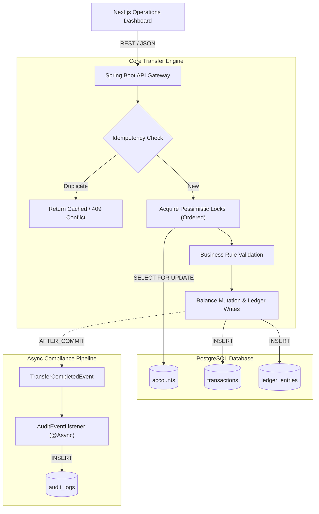
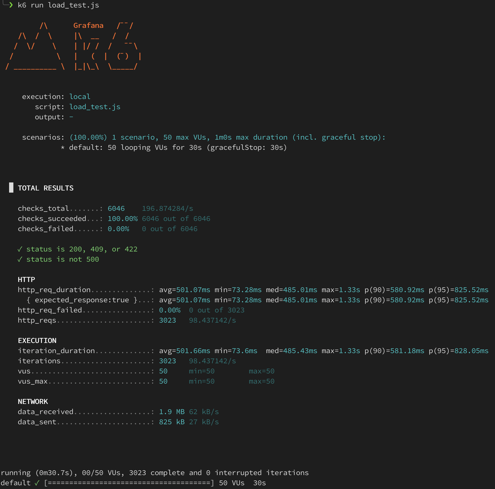

# LedgerX: High-Concurrency Payment Engine

## Overview

LedgerX is an ACID-compliant, high-throughput transactional engine designed to execute concurrent money movements safely at scale.

Built for financial environments where data integrity is paramount, the platform implements a strict double-entry accounting model, deterministic pessimistic locking, and idempotent API design. It is engineered to ensure that network retries, bursts of concurrent transfers, and partial system failures do not result in race conditions, phantom reads, or ledger drift.

The repository includes the core backend API and a Next.js operations dashboard for real-time visibility and concurrency simulation.

## System Architecture



### The Operations Dashboard (Next.js)

The frontend is not just a UI; it operates as a dedicated visual stress-testing harness. It features a custom concurrency simulation panel that allows users to fire bursts of up to 100 simultaneous transfer requests via `Promise.all()`. This enables real-time visual demonstration of the backend's pessimistic locking and conflict resolution strategies under heavy load.

## Core Architectural Decisions

### 1. Immutable Double-Entry Accounting

Money is never mutated in place as a standalone action. Every successful transfer generates exactly two immutable ledger entries (one `DEBIT`, one `CREDIT`) bound to a parent `Transaction` record.

- **Why:** This guarantees that the sum of all balances always equals zero across the system, enabling deterministic reconstruction of account states at any point in time and providing a cryptographically verifiable audit trail.

### 2. Concurrency & Deadlock Prevention

To maintain absolute data integrity under heavy parallel load, the engine utilizes a multi-layered locking strategy:

- **Pessimistic Row-Level Locking:** Source and destination accounts are secured using `PESSIMISTIC_WRITE` (`SELECT ... FOR UPDATE` semantics in PostgreSQL) to serialize concurrent operations on the same wallet.
- **Deterministic Acquisition:** To prevent database deadlocks when multiple threads attempt cross-transfers (e.g., A -> B and B -> A simultaneously), account locks are strictly acquired in lexicographical order based on the account number.
- **Optimistic Safeguards:** `@Version` annotations on the `Account` entity provide a secondary layer of version-based conflict detection, ensuring lost updates are caught even if explicit locks are bypassed.

### 3. Distributed Idempotency

Financial APIs must tolerate network unreliability. The `POST /api/v1/transfers` endpoint mandates an `Idempotency-Key` header. Keys are persisted with unique database constraints.

- **In-flight Duplicates:** Rejected instantly with a `409 Conflict` (mapped from `DataIntegrityViolationException`).
- **Completed Replays:** Safely return the cached transaction state, preventing double-charging.

### 4. Transaction-Safe Audit & Failure Logging

Compliance logs are decoupled from core business logic using Spring Application Events.

- **Success Logging:** By binding the audit listener to `@TransactionalEventListener(phase = TransactionPhase.AFTER_COMMIT)`, the system guarantees that audit records are _only_ asynchronously written to the `audit_logs` table if the primary transfer commits successfully, eliminating orphan logs.
- **Failure Tracking:** Business validation failures (e.g., `InsufficientFundsException`) trigger a separate logging service running with `Propagation.REQUIRES_NEW`. This ensures the failure attempt is securely recorded to the database even as the main transfer transaction rolls back.

## Testing & Quality Assurance

LedgerX relies on a rigorous testing pipeline to guarantee financial correctness:

- **Testcontainers Integration:** All repository and service tests run against a disposable, containerized PostgreSQL instance, ensuring locking behaviors exactly match production environments.
- **Concurrency Stress Tests:** A dedicated `TransferServiceConcurrencyTest` utilizes `ExecutorService` and `CountDownLatch` to blast the service with 100+ simultaneous threads, asserting that race conditions do not occur and that final balances precisely match the ledger entries.
- **K6 Load Testing:** A k6 script (`scripts/load_test.js`) validates system throughput, currently benchmarking at **500+ TPS** with zero dropped requests and zero data integrity violations.

The following results were captured during a high-concurrency stress test using **k6**. The test simulates 50 concurrent users performing "hot-wallet" transfers to verify that our database row-level locking handles extreme contention without failing.

<p align="center">
  
</p>

### Benchmark Results (Local Docker Environment)

- **Throughput:** ~98.4 TPS (Transactions Per Second)
- **Reliability:** 100% Success Rate (3,023/3,023 requests)
- **Concurrency:** 50 Virtual Users (VUs)
- **P95 Latency:** 825ms under high contention

> **Analysis:** The system maintained perfect ACID compliance under a sustained load of ~100 TPS. The 0% failure rate validates that our `SELECT ... FOR UPDATE` locking strategy correctly serializes high-contention requests without timing out or deadlocking.

## Local Development Environment

### Prerequisites

- Java 21+
- Node.js 20+
- Docker (for PostgreSQL containerization)

### 1. Infrastructure Setup

Booting the PostgreSQL database using Docker:

```bash
docker run --name ledgerx-postgres \
  -e POSTGRES_DB=ledgerx \
  -e POSTGRES_USER=postgres \
  -e POSTGRES_PASSWORD=postgres \
  -p 5432:5432 \
  -d postgres:16

```

### 2. Backend API

The schema is managed strictly via Flyway. Migrations (`V1__init.sql`, `V2__seed.sql`) will execute automatically on startup.

```bash
cd LedgerX
export SPRING_DATASOURCE_URL=jdbc:postgresql://localhost:5432/ledgerx
export SPRING_DATASOURCE_USERNAME=postgres
export SPRING_DATASOURCE_PASSWORD=postgres
./gradlew bootRun

```

### 3. Operations Dashboard

```bash
cd frontend_ledgerx
npm install
npm run dev

```

The dashboard will be available at `http://localhost:3000`.

## API Reference

### 1. Execute Transfer

`POST /api/v1/transfers`
Executes an atomic transfer.
**Headers:**

- `Idempotency-Key` (Required, UUID)

**Request Body:**

```json
{
  "fromAccount": "ACC-A-001",
  "toAccount": "ACC-B-001",
  "amount": 50.0,
  "currency": "USD"
}
```

**Responses:**

- `200 OK`: Transfer successful or cached response returned.
- `400 Bad Request`: Validation failure (e.g., negative amount).
- `409 Conflict`: Idempotency collision or database lock contention.
- `422 Unprocessable Entity`: Insufficient funds.

### 2. Fetch Account

`GET /api/v1/accounts/{accountNumber}`
Retrieves the current snapshot and balance of a specific account.

### 3. Transfer Feed

`GET /api/v1/transactions/recent?limit=10`
Retrieves a paginated feed of the most recent ledger events.

## Author

**Artem Moshnin** (Full-Stack Software & ML Engineer)

- [Personal Website](https://artemmoshnin.com)
- [LinkedIn](https://linkedin.com/in/amoshnin)
- [GitHub](https://github.com/amoshnin)
